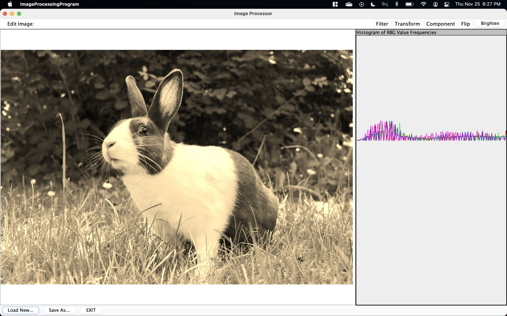
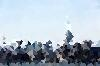

# ImageProcessing

**A Java-based image processing application with an intuitive GUI for applying filters and transformations, showcasing skills in object-oriented programming, GUI design, and image manipulation algorithms.**

---

## GUI

Our Image Processing GUI:

---

## Example using our Mosiac Feature

Skyline before mosiac

Skyline after mosaic is created with 1000 random points

---

## Project Overview

**ImageProcessing** is a comprehensive Java application designed to transform and enhance images using a range of filters and editing tools. This project highlights my expertise in Java programming, software architecture, and user interface design, as well as my understanding of image processing techniques. Built from the ground up, the project is structured with a clear Model-View-Controller (MVC) architecture, making it scalable and easy to extend with new features.

---

## Key Skills Demonstrated

- **Java Development**: In-depth use of Java for both backend logic and frontend GUI.
- **Image Processing Algorithms**: Implemented core image processing functions (mosaic, grayscale, transformations, etc.) using foundational algorithms.
- **Software Design Patterns**: Utilized the MVC pattern for modularity and separation of concerns.
- **GUI Development**: Built a user-friendly interface that allows seamless interaction with processing tools.

---

## Features

- **Image Mosaic**: Algorithmically generates mosaic effects with customizable patterns.
- **Filter Application**: Apply various filters (grayscale, sepia, blur) with optimized processing time.
- **Transformations**: Rotate, crop, and resize images with real-time preview.
- **Enhancements**: Adjust brightness and contrast to improve image clarity.
- **Edge Detection**: Employs algorithms for identifying edges and adding depth to images.

---

## Technical Architecture

The project follows a **Model-View-Controller (MVC)** structure:

1. **Model**: Contains core processing functions and algorithms for each filter and transformation.
2. **View**: Provides a graphical user interface built with Java Swing, enabling real-time preview and easy navigation.
3. **Controller**: Acts as the mediator between user actions in the View and the processing functions in the Model.

This structure ensures flexibility and makes it easy to add new functionalities.

---

## Why This Project Matters
This project was designed to highlight my technical expertise in Java and image processing, as well as my ability to design an interactive application with real-world use cases. Through building this program, I demonstrated my skills in:

1. Problem-Solving: Solving complex problems related to image manipulation, such as edge detection and mosaic creation.
2. Software Engineering: Applying best practices for code structure, modularity, and clean design patterns.
3. User-Centered Design: Developing a GUI that balances functionality with ease of use.

---
